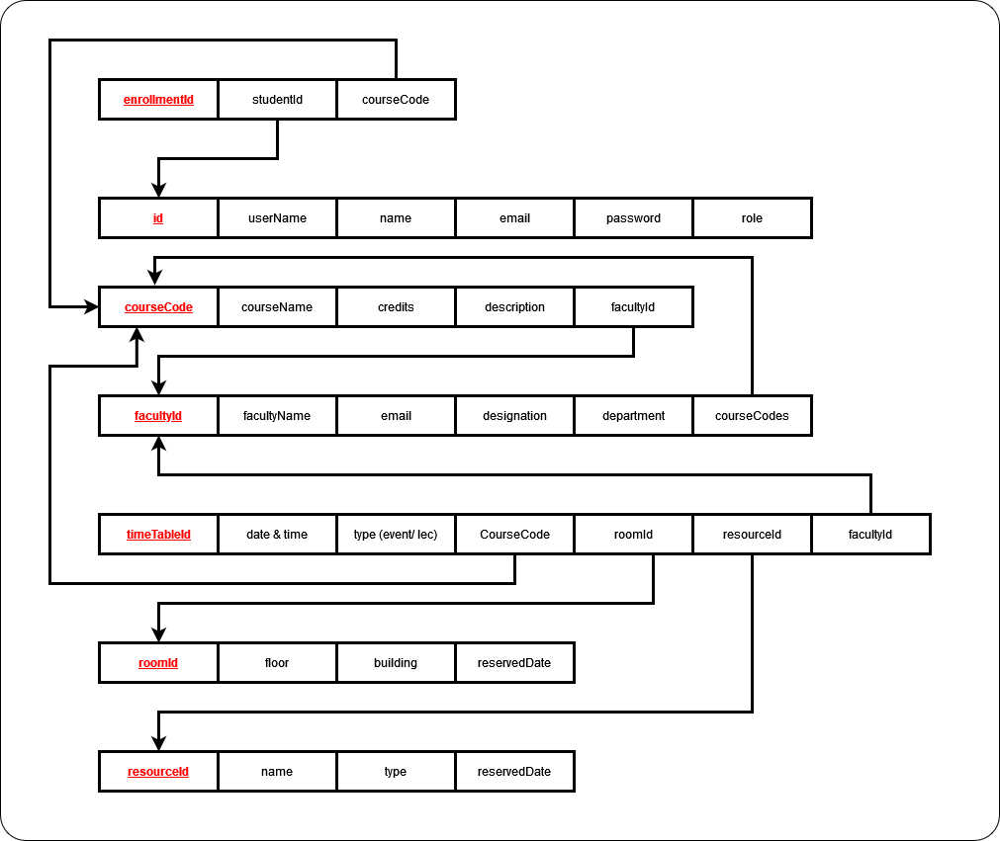

# Project : Learnium - Course Catalog management system for universities.

A web application backend implementation for managing university resources including courses, timetable, room and resource booking, student enrollment, and notifications.

## Table of Contents

1. [Introduction](#introduction)
2. [Setup Instructions](#setup-instructions)
3. [API Endpoint Documentation](#api-endpoint-documentation)
4. [Testing](#testing)
   - [Setup for Testing Environments](#setup-for-testing-environments)
   - [Unit Tests](#unit-tests)
   - [Integration Tests](#integration-tests)
5. [ER Diagram](#er-diagram)
6. [Schema Diagram](#schema-diagram)
7. [Non-Functional Requirements](#non-functional-requirements)
   - [Security](#security)
   - [Database Design](#database-design)
   - [Code Quality and Documentation](#code-quality-and-documentation)
   - [Error Handling and Logging](#error-handling-and-logging)

## Introduction

The University Management System is built using Spring Boot, following the MVC architecture. It facilitates the management of courses, timetables, room and resource bookings, student enrollments, and notifications.

## Setup Instructions

## Project Setup Instructions

## Prerequisites

Before beginning, ensure you have met the following requirements:

- You have installed the latest version of [Java](https://www.oracle.com/java/technologies/javase-jdk11-downloads.html) (Java 11 or later is recommended).
- You have installed [Maven](https://maven.apache.org/download.cgi).
- You have a Windows machine. This guide is written with Windows users in mind.
- You have read access to the `springboot-mongo-atlas` repository.

## Installing Learnium Springboot app : `springboot-mongo-atlas`

To install `springboot-mongo-atlas`, follow these steps:

1. Clone the `springboot-mongo-atlas` repository from GitHub to your local machine:

```bash
git clone https://github.com/sliitcsse/assignment-01-Harish3000.git
```

2. Navigate to the project directory:

```bash
cd springboot-mongo-atlas
```

## Running `springboot-mongo-atlas`

To run `springboot-mongo-atlas`, follow these steps:

1. Build the project using Maven:

```bash
mvn clean install
```

2. Run the application:

```bash
mvn spring-boot:run
```

The application should now be running on `localhost:8080`.

## Running Tests

To run the tests in the `springboot-mongo-atlas` project, follow these steps:

### Unit Tests

To run the unit tests in the `com.learnium.springbootmongoatlas.UnitTests` package, use the following command:

```bash
mvn -Dtest=com.learnium.springbootmongoatlas.UnitTests.* test
```

### Integration Tests

To run the integration tests in the `com.learnium.springbootmongoatlas.IntegrationTests` package, use the following command:

```bash
mvn -Dtest=com.learnium.springbootmongoatlas.IntegrationTests.* test
```

Please note that the tests will run using the configurations specified in your `pom.xml` file.

## Non-Functional Requirements

### Security

Security is implemented using Spring Security and JWT (JSON Web Tokens). Users are authenticated and authorized based on their roles.

### Database Design

The database design is optimized for efficient data storage and retrieval, minimizing redundancy and ensuring data integrity.

### Schema Diagram



## Code Quality and Documentation

### Accessing API Documentation with Swagger

Swagger is a powerful tool for designing, building, and documenting RESTful APIs. It provides a user-friendly interface to explore and test your API endpoints.

Here are the steps to access the API documentation using Swagger in your project:

1. Start your application by running the following command in your terminal:

```bash
mvn spring-boot:run
```

2. Once your application is running, open your web browser and navigate to the Swagger UI. The URL is usually in the following format:

```
http://localhost:8080/swagger-ui.html
```

Replace `localhost:8080` with your application's host and port if they are different.

3. You should now see the Swagger UI, which displays your API's endpoints. You can expand each endpoint to see its details, such as the HTTP method, parameters, responses, and more. You can also try out each endpoint directly from the Swagger UI.

## Error Handling and Logging

Custom exception handling is implemented to handle errors gracefully, providing meaningful error messages to users. Logging is performed using a custom logger to track system activities and errors.
